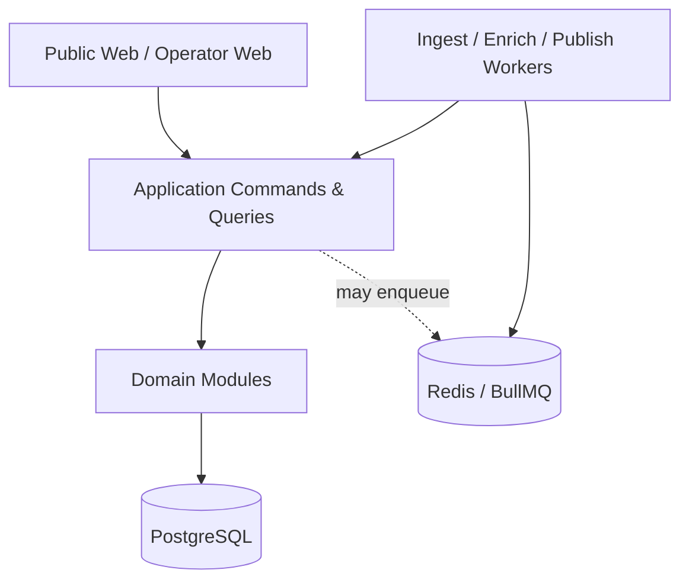
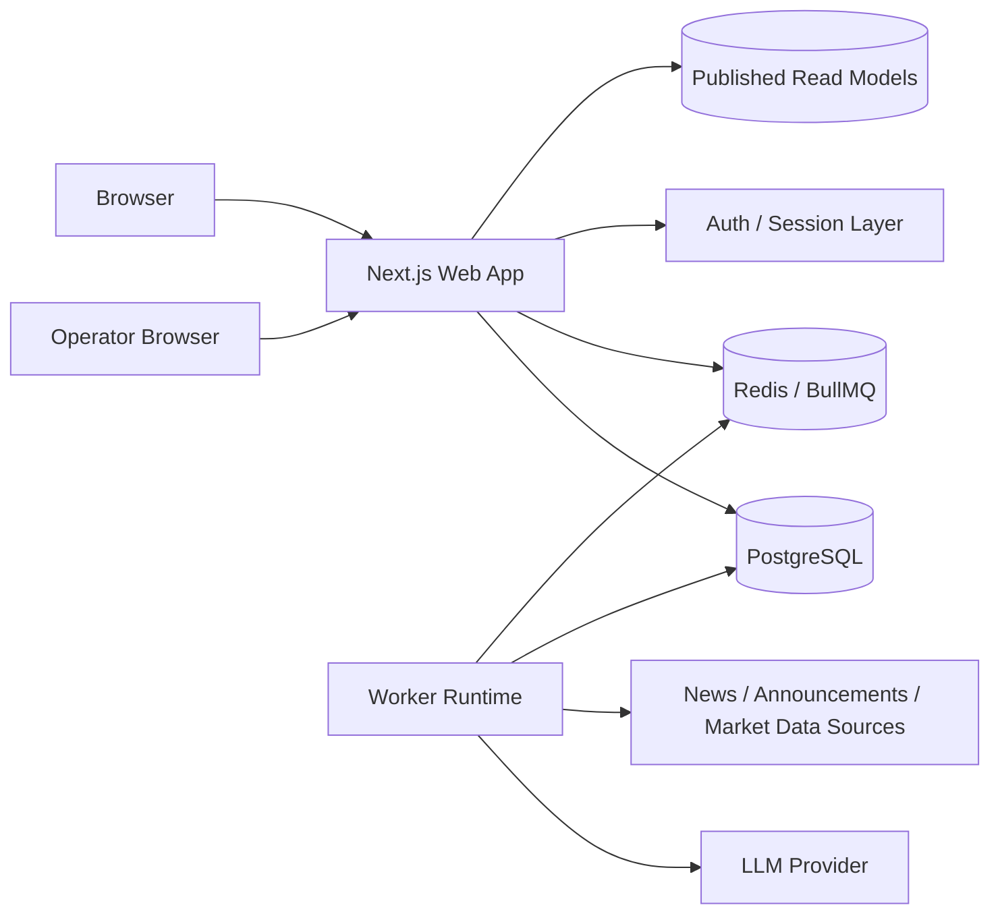
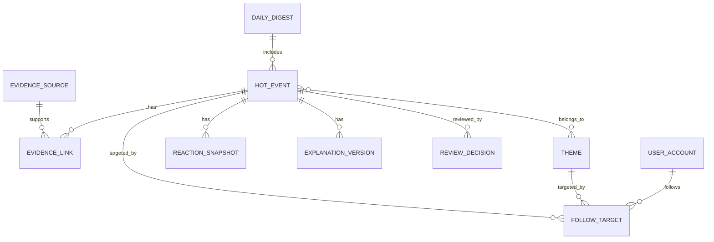
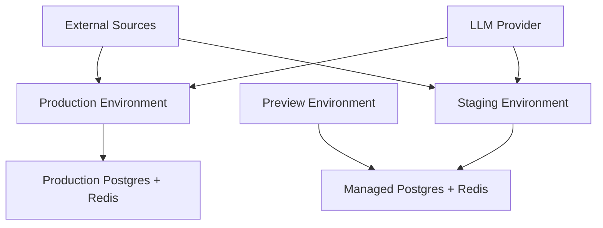

# Architecture Spine — AGUHOT

## Design Paradigm

AGUHOT 采用 **modular monolith with event-driven ingest pipeline**。

- `apps/web` 承载公开 Web 与运营后台界面。
- `apps/worker` 承载采集、归一化、聚类、解释、日报生成和发布链路。
- `packages/core` 承载领域模块、应用命令、查询契约、外部适配器接口。
- `packages/ui` 承载 DESIGN/EXPERIENCE 落地后的共享组件与 design tokens。

公开读路径和后台操作路径共用同一套领域规则，但运行时职责分离：Web 进程只提供请求响应；Worker 进程承担所有重计算、重试和外部调用。



## Invariants & Rules

### AD-1 — 单体内分模块，禁止按功能早拆微服务

- **Binds:** all
- **Prevents:** 采集、解释、发布、后台复核各自长成独立服务并复制规则
- **Rule:** V1 必须保持单仓、单域模型、双运行时（`web` + `worker`）的 modular monolith 形态。任何新能力先落在既有模块边界内；除非出现明确的独立部署需求，否则不得为“看起来更先进”而先拆服务。

### AD-2 — 热点内容必须有单一写拥有者

- **Binds:** 热点事件流, 热点事件详情与证据时间线, 市场反应与关联展示, 日报与主题页
- **Prevents:** 两个模块分别修改同一 `HotEvent`、`Theme` 或 `Evidence` 记录导致归组和展示冲突
- **Rule:** `source-ingest` 模块只拥有原始 `EvidenceSource` 与采集状态；`event-assembly` 模块只拥有 `HotEvent` 聚类与合并拆分结果；`theme-linking` 模块只拥有 `Theme` 关联；`market-reaction` 模块只拥有 `ReactionSnapshot`。模块之间不得跨边界直接更新对方聚合根，只能通过应用命令或持久化队列事件请求变更。

### AD-3 — 公开站只读发布态读模型

- **Binds:** 热点事件流, 热点事件详情与证据时间线, 日报与主题页, 搜索与关注列表
- **Prevents:** 首页、详情、日报、主题页各自临时拼 SQL，导致排序、可见性和性能行为不一致
- **Rule:** 所有公开页面与公开 API 只能读取 `published_*` 读模型或等价 materialized read model，不能直接读取原始采集表、处理中间表或运营工作表。发布态读模型由 `publish-orchestrator` 统一生成与刷新。

### AD-4 — 重计算与外部调用全部走异步流水线

- **Binds:** 热点事件流, 热点事件详情与证据时间线, 日报与主题页, 运营复核
- **Prevents:** 请求路径同步调用抓取、LLM、聚类、日报生成，造成超时、重试混乱和不可复现结果
- **Rule:** 采集、正文抽取、去重、聚类、解释生成、市场信号汇总、日报生成、主题回填一律以 BullMQ job 执行。Web 请求路径只能触发轻量命令、查询发布态结果或提交运营动作，不得同步等待 LLM 或外部源返回。

### AD-5 — 解释与复核记录必须版本化、可追溯、可回滚

- **Binds:** 热点事件详情与证据时间线, 运营复核
- **Prevents:** 解释文案被原地覆盖，后续无法知道哪一版来自 AI、哪一版来自人工、为何撤下
- **Rule:** `ExplanationVersion`、`ReviewDecision`、`PublicationDecision` 必须采用追加式记录。公开页只展示当前 `published` 版本；运营台必须能看到版本链、来源链和状态链。任何“下线”“合并”“拆分”“改标题”“改解释”都是新版本或新决策，不允许原地抹写历史。

### AD-6 — 运营复核是发布闸门，不是旁路修补

- **Binds:** 运营复核, 热点事件流, 热点事件详情与证据时间线
- **Prevents:** 公开内容先放出去，再靠后台偷偷修表；或者公开态和后台态同时存在多个真相
- **Rule:** 高影响动作（公开展示、下线、合并、拆分、解释修订、来源屏蔽）必须经过 `review-workflow` 模块形成明确的 `publication_status`。公开站对 `publication_status != published` 的内容不可见；运营台修改不能绕开该工作流直写公开读模型。

### AD-7 — 外部来源与模型供应商全部走适配器端口

- **Binds:** 热点事件流, 热点事件详情与证据时间线, 日报与主题页
- **Prevents:** 源站抓取逻辑和 LLM SDK 侵入领域模块，后期切源或切模型时全链路扩散修改
- **Rule:** 外部财经源、公告源、行情源、LLM 供应商都必须通过 `SourceAdapter`、`MarketDataAdapter`、`LLMAdapter` 端口进入系统。领域模块与发布模块不能直接 import 第三方 SDK。切换供应商只能发生在 adapter 层和 worker 装配层。

### AD-8 — 用户身份不得成为公共内容路径依赖

- **Binds:** 搜索与关注列表, 热点事件流, 热点事件详情与证据时间线, 日报与主题页
- **Prevents:** 为了收藏或轻个性化而把所有公开消费路径绑到登录态，拖慢首达价值
- **Rule:** 公共内容浏览、搜索、详情阅读、日报阅读、主题追踪默认匿名可用。`user-profile` 模块只拥有 `关注列表`、个人偏好和后续通知订阅，不得反向要求热点内容模块依赖用户身份才能返回基础内容。

## Consistency Conventions

| Concern | Convention |
| --- | --- |
| Naming (entities, files, interfaces, events) | 领域实体用单数 PascalCase；数据库表用 snake_case 复数；队列名与 job 名用 kebab-case；领域事件用过去式 PascalCase，如 `HotEventPublished`。 |
| Data & formats (ids, dates, error shapes, envelopes) | 所有主键使用 UUIDv7；所有时间存 UTC；对外 API 时间统一 ISO 8601；公开 API 统一 `data / meta / error` 三段式响应；涨跌和比率以 decimal 存储、按展示层格式化。 |
| State & cross-cutting (mutation, errors, logging, config, auth) | 写操作只经应用命令入口；错误按 `domain / adapter / transient` 分类；每个请求和 job 都带 `trace_id`；配置通过环境变量注入；公开读路径匿名，关注/后台路径才要求认证。 |

## Stack

| Name | Version |
| --- | --- |
| Node.js | 24.18.0 LTS |
| TypeScript | 5.9 |
| Next.js (App Router) | 16.x |
| React | 19.2 |
| Tailwind CSS | 4.x |
| shadcn/ui CLI | 4.x |
| Base UI (shadcn default base) | 1.6.0 |
| PostgreSQL | 18 |
| Prisma ORM | 7.7.0 |
| Redis | 8 |
| BullMQ | 5.79.3 |
| Playwright | 1.60 |

## Structural Seed







```text
apps/
  web/
    app/
      (public)/          # 首页、详情、日报、主题、搜索、关注
      (operator)/        # 运营复核台
      api/               # route handlers / internal webhooks
  worker/
    src/
      queues/            # BullMQ workers and schedulers
      jobs/              # ingest / cluster / explain / publish / digest
packages/
  core/
    src/
      modules/
        source-ingest/
        event-assembly/
        theme-linking/
        market-reaction/
        publish-orchestrator/
        review-workflow/
        search-read/
        user-profile/
      contracts/         # command/query DTOs, ports
      shared/            # ids, time, errors, tracing
  ui/
    src/
      components/        # shared UI components
      tokens/            # DESIGN.md token mapping
  config/
    src/                 # env parsing, feature flags
```

## Capability → Architecture Map

| Capability / Area | Lives in | Governed by |
| --- | --- | --- |
| 热点事件流 | `apps/web/(public)` + `event-assembly` + `publish-orchestrator` | AD-1, AD-2, AD-3, AD-4 |
| 热点事件详情与证据时间线 | `apps/web/(public)` + `source-ingest` + `event-assembly` + `review-workflow` | AD-2, AD-3, AD-4, AD-5, AD-6 |
| 市场反应与关联展示 | `market-reaction` + `theme-linking` + public read models | AD-2, AD-3, AD-4 |
| 日报与主题页 | `publish-orchestrator` + `theme-linking` + `apps/web/(public)` | AD-3, AD-4, AD-5 |
| 搜索与关注列表 | `search-read` + `user-profile` + `apps/web/(public)` | AD-3, AD-8 |
| 运营复核 | `apps/web/(operator)` + `review-workflow` | AD-1, AD-5, AD-6 |

## Deferred

- 具体云厂商与部署平台：当前只固定运行时分离和状态组件，不绑定 Vercel / self-host / K8s。
- 具体财经数据源与公告源采购名单：当前只固定 adapter 口和异步写路径，不固定供应商。
- 搜索引擎是否引入专用全文检索：V1 可先用 PostgreSQL 能力，等真实查询负载出现再决定是否上专用搜索栈。
- 是否引入 WebSocket / SSE 实时推送：V1 先保证读模型刷新与主动拉取体验。
- 是否对低风险事件自动发布：先保留 `review-workflow` 闸门，自动发布策略等真实运营负载后再下放。
- 是否提供机构 API：不属于当前 feature altitude；若进入专业终端或 API 产品线，再起新 spine。
